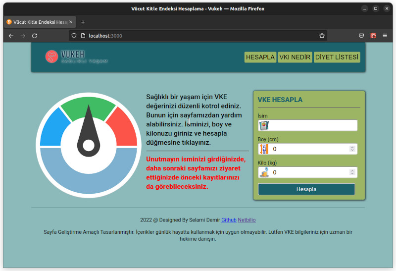

# Vukeh - Vücut Kitle Endeksi Hesaplama Uygulaması

Demo sayfasına [tıklayın](https://vukeh.netlify.app/).
## Rozetler


[](https://choosealicense.com/licenses/mit/)


  
## Katkı

Katkılara her zaman açığız!

Başlamak `Contributor.md'ye bakın.

Lütfen bu projenin `davranış kurallarına` uyun.

  
## Ekran Görüntüleri



  
## Kullanılan Teknolojiler

**İstemci:** React, React Router Dom, Styled Component
  
## Testler

Testleri çalıştırmak için aşağıdaki komutu çalıştırın

```bash
  npm run test
```


  